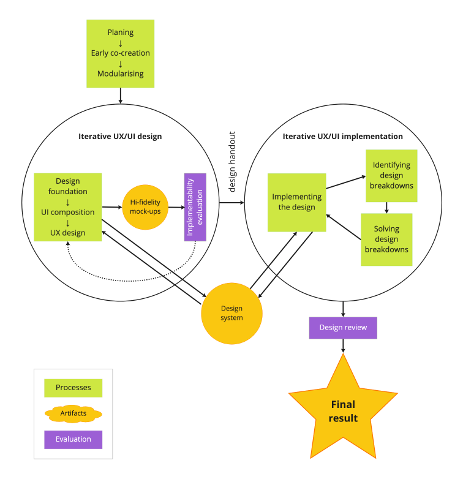

In the rapidly evolving field of user interface (UI) creation, the alignment between UX
designers and UI developers is a critical factor that can significantly impact the
efficiency and effectiveness of the design and development process. This review delves into Varya Stepanova's insightful thesis on the role of design systems in bridging the gap between these two key players. As digital products continue to shape our lives and businesses, understanding the dynamics of UX/UI development and the potential solutions to its inherent challenges is of paramount importance. This review aims to provide a comprehensive analysis of Varya Stepanova's work, shedding light on her findings and their implications for both practitioners and researchers in the field. Whether you're a UX designer, a UI developer, a project manager, or simply someone interested in the intricacies of UI creation, this review offers valuable insights that can enhance your understanding and potentially inform your practice.
In her [thesis](https://varya.me/design-systems/aligning-ux-designers-and-ui-developers/), Varya Stepanova explores the role of design systems in bridging the gap between UX designers and UI developers in the process of UI creation. The author delves into the challenges faced by these two groups due to their different mental models and working methodologies, and how design systems can facilitate their collaboration.

The thesis begins by acknowledging the significant gap between design and development processes in software creation. The author identifies the need for a tool that can align the work of UX designers and UI developers, and proposes design systems as a potential solution. Design systems are defined as continuously evolving sets of reusable design and development elements of user interfaces that align with a company's brand identity and UX design principles.

The author presents a comprehensive analysis of the current state of UX/UI development, highlighting the challenges at the project, process, and personal levels. The study reveals that the traditional "design-agency" model, where designs are created upfront and passed to developers for implementation, often leads to inefficiencies and miscommunications. The author suggests that a more iterative and collaborative approach, such as the dual-track agile workflow, could be more effective.

The thesis also explores the concept of "design breakdowns," which are impediments that must be fixed before a design can be implemented. These breakdowns can be caused by missing information, edge cases, and technical constraints, and often lead to significant delays and rework.

Design systems are proposed as a solution to these issues. By providing a shared language and set of components, design systems can help align the work of designers and developers, reducing the occurrence of design breakdowns and improving the efficiency of the design-and-development process.

The author concludes that using design systems can bring projects and organizations to higher levels of maturity according to the Capability Maturity Model Integration (CMMI-DEV) representation. The study recommends the use of design systems to speed up the design-and-development process and enhance the maturity level of this process and the organization.

In summary, this thesis provides a detailed and insightful exploration of the role of design systems in aligning UX designers and UI developers. It presents a compelling argument for the adoption of design systems as a tool to improve the efficiency and effectiveness of UI creation. The research is well-grounded in existing literature and provides valuable recommendations for both practitioners and researchers in the field.

The thesis is well-structured and logically organized, making it easy to follow the author's arguments and understand the key points. The author's use of real-world examples and case studies adds depth to the discussion and helps to illustrate the practical implications of the research.

One of the strengths of the thesis is its comprehensive literature review, which provides a solid foundation for the author's arguments. The author critically analyzes the existing literature and identifies gaps in the current understanding of the role of design systems in UX/UI development. This thorough review of the literature not only strengthens the author's arguments but also highlights the originality and significance of the research.

The author's discussion of the challenges faced by UX designers and UI developers is particularly insightful. The author not only identifies these challenges but also explores their underlying causes, providing a nuanced understanding of the complexities of UX/UI development. This deep understanding of the challenges informs the author's proposed solutions, making them more credible and convincing.

The author's proposal to use design systems as a tool to align the work of UX designers and UI developers is well-argued and supported by evidence. The author provides a clear explanation of how design systems can help to overcome the challenges identified in the research, making a strong case for their adoption.

The author's conclusion that using design systems can enhance the maturity level of the design-and-development process and the organization is an important contribution to the field. This finding has significant implications for both practice

and research, suggesting that the adoption of design systems can lead to improved efficiency and effectiveness in UI creation.

The thesis also provides valuable insights into the concept of "design breakdowns" and their impact on the design-and-development process. The author's exploration of this concept adds depth to the understanding of the challenges faced in UX/UI development and highlights the need for tools and approaches that can help to prevent these breakdowns.

One potential area for further research suggested by the thesis is the exploration of how design systems can be effectively integrated into different organizational contexts. While the author provides a compelling argument for the adoption of design systems, the practicalities of implementing these systems in different organizational contexts are not fully explored. Future research could investigate this issue, providing further insights into the effective use of design systems in practice.

The thesis could also benefit from a more detailed exploration of the potential limitations and challenges of using design systems. While the author acknowledges that design systems are not a panacea for all the challenges faced in UX/UI development, a more detailed discussion of the potential drawbacks and limitations of these systems would provide a more balanced view.

Overall, this thesis makes a significant contribution to the understanding of the role of
design systems in aligning UX designers and UI developers. The author's thorough analysis of
the challenges faced in UX/UI development and the proposed solutions provide valuable insights
for both practitioners and researchers in the field. The thesis is well-written,
logically organized, and grounded in a comprehensive review of the literature, making it a
valuable resource for anyone interested in the field of UX/UI development. To fully appreciate
the depth of Varya Stepanova's research and the potential impact of her findings, it is
highly recommend delving into [the full text of the thesis](https://varya.me/design-systems/aligning-ux-designers-and-ui-developers/). 