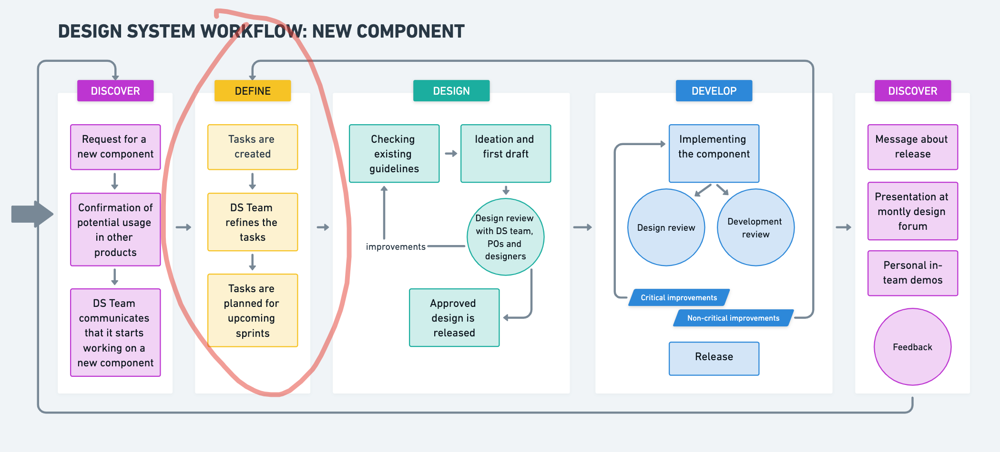

import LayoutBlog from '@components/layout/layoutBlog';
import thumb from './thumb.png';

<LayoutBlog 
  title="Define your Rock-Solid Design System Components"
  date="2024-06-11"
  description="Craft exceptional design systems with clear and collaborative component definitions. Discover how our process ensures strong, maintainable components that boost communication, speed up development, and guarantee a seamless user experience."
  thumb={thumb}
  seo={{
    desc: "Craft exceptional design systems with clear and collaborative component definitions. Discover how our process ensures strong, maintainable components that boost communication, speed up development, and guarantee a seamless user experience."
  }}>

In our team, defining components is super important. It makes sure everyone's on
the same page, especially since we work remotely and come from different backgrounds. 
Having a clear understanding from the start is key to avoiding confusion later on.
That's where our design system architect comes in – they're like a super sleuth who
makes sure no detail gets missed when we define our components.



## Why defining components matters?

The very first step, defining what each component does, is essential for the entire
development process.  It acts as a bridge between design and development, ensuring
everyone on the team is on the same page, regardless of location or background. This
focus on defining components upfront helps us avoid misunderstandings later and
ensures the final product meets all the requirements.

Our design system architect plays a key role in this process. Their extensive experience
and sharp eye for detail often catch things the design team might miss.  Their main
focus is making sure our components are not only visually consistent but also
functionally strong and easy to maintain in the long run.

## How we nail down our components

Here's the step-by-step process for defining our components:

#### 1. Digging into the Code and Beyond

The definition process begins with research. This involves two key areas:

- **Internal Codebase Review**: First, we take a deep dive into our existing code to see
if something similar already exists. This way, we can make sure all the features we need
are there. If anything needs to be changed, we explain why and come up with even better
options.
  
- **Industry Research**: Next, we hit the books – well, kind of. We check out what other
design systems built with similar tools (like React or Web Components) are doing. We don't
just copy everything though, we pick what works best for our specific product.

#### 2. Blueprinting the Component

Once we've gathered all this info, the design system architect puts together a detailed
blueprint of the component. This basically lists everything the component can do, how it
can be adjusted, and any tricky situations it might encounter. Think of it as a roadmap
for building the component.

#### 3. Team Huddle to Finalize

The whole team then gets involved to make sure this blueprint is solid. Designers and
developers chat about the component together. This helps ensure the design can actually
be built and includes everything that's needed. By the end, we have a refined component
description that's clear and complete.

### The Perks of Planning Our Components

We've been using this approach for a while now on many projects, and it's definitely a
winner! Here's why:

One of the key benefits of this approach is enhanced communication. Because our descriptions
are clear and detailed, everyone on the team understands exactly what the component does.
This is especially helpful for our remote and culturally diverse team, where misunderstandings
can sometimes happen.

Additionally, this method increases efficiency.  With all the details written down, developers
can jump right into coding without having to guess what's required. This saves us a bunch of
time!

By taking the time to plan things out carefully, we end up with components that are
well-tested and dependable. For example,
with detailed component definitions, it becomes easier to practice Test-Driven Development (TDD).
Often, the definition itself contains a list of tests to cover. If not, these tests are still
straightforward to create before the implementation begins, ensuring a smooth development process. 

Below is an example of a component description for a new Popover component:

## Popover Component Description

There is a new `<Popover>` component to enhance user interaction by displaying additional
information or controls. It fits the new design as shown in Figma.

### Parameters

**Controlled State**
- `open` (optional): A boolean parameter that controls the open state of the Popover. When `true`, the Popover is displayed. When `false`, it is hidden. Must be used in conjunction with `onOpenChange`.
- `onOpenChange` (optional): A function parameter that takes a callback function, triggered when the open state changes.

**Positioning and Alignment**
- `side` (optional): A string parameter that specifies the position of the Popover relative to its trigger element. Possible values are `top`, `bottom`, `left`, and `right`. Default is `bottom`.
- `align` (optional): A string parameter that specifies the alignment of the Popover relative to its trigger element. Possible values are `start`, `center`, and `end`. Default is `center`.
- `sideOffset` (optional): A number parameter that sets the distance from the trigger element. Default is `2`.
- `alignOffset` (optional): A number parameter that sets an offset from the alignment options `start` or `end`.

**Collision Handling**
- `avoidCollisions` (optional): A boolean parameter that, when `true`, overrides the `side` and `align` preferences to prevent collisions with boundary edges. Default is `false`.

**Display and Content**
- `displayTip` (optional): A boolean parameter that determines whether to display a tooltip arrow within the Popover. When `true`, a tooltip arrow is displayed. Default is `false`.
- `children` (optional): A ReactNode parameter that specifies the content to be displayed within the Popover container.

**Styling and Customization**
- `className` (optional): A string parameter that sets custom CSS classes for the Popover container.
- `id` (optional): A string parameter that sets a unique identifier for the Popover container.
- `tabIndex` (optional): A number parameter that sets the tab index for keyboard navigation. Default is `0`.

**Events**
- `onChange` (optional): A function parameter that takes a callback function, triggered when the Popover content changes.
- `onInput` (optional): A function parameter that takes a callback function, triggered when the Popover receives input.
- `onFocus` (optional): A function parameter that takes a callback function, triggered when the Popover gets focus.
- `onBlur` (optional): A function parameter that takes a callback function, triggered when the Popover loses focus.

### Accessibility

The Popover component adheres to several accessibility standards:
- The root element of the Popover uses `role="dialog"` to indicate it is a dialog.
- The trigger element should be focusable and interactive, ensuring it can be activated via keyboard navigation.
- When the Popover is open, it sets `aria-expanded="true"` on the trigger element to indicate the expanded state.
- The Popover content should be easily dismissible, either through a close button or by clicking outside the Popover.

### Subcomponents

The Popover component includes several subcomponents to structure its content:
- `Popover.Trigger`: Element that triggers the Popover.
- `Popover.Content`: Container for the Popover content.
- `Popover.Close`: Element that triggers the closing of the Popover.
- `Popover.Anchor`: Element that anchors the Popover to another element.

### Example Usage

```jsx
import { Popover } from './Popover';
import { Button } from '../button';
import { Paragraph } from '../typography/typography';

const Example = () => {
  const [isOpen, setIsOpen] = useState(false);

  return (
    <Popover open={isOpen} onOpenChange={setIsOpen}>
      <Popover.Trigger asChild>
        <Button>Open</Button>
      </Popover.Trigger>
      <Popover.Content side="bottom" align="center" displayTip>
        <Paragraph size="s">
          End hunger, achieve food security, and promote sustainable agriculture.
        </Paragraph>
      </Popover.Content>
    </Popover>
  );
};
```

### Focus and Interaction Accessibility Checks

The Popover component should pass the following accessibility checks to ensure it is user-friendly and complies with accessibility standards:

1. **Keyboard Navigation**:
   - Press `Tab` to focus on the Popover trigger element.
   - Press `Tab` or `Shift + Tab` to navigate between the trigger element and other focusable elements within the Popover.
   - Press `Space` or `Enter` to open the Popover when focused on the trigger element.
   - Press `Escape` to close the Popover when it is open.

2. **Screen Reader Support**:
   - Ensure the Popover content is announced by screen readers when it is opened.
   - Use `aria-expanded` and `aria-controls` on the trigger element to indicate the open state and the associated Popover content.

3. **Dismissibility**:
   - Clicking outside the Popover should close it.
   - Include a `Popover.Close` element or an equivalent mechanism to allow users to close the Popover.

### Testing

The Popover component should be tested for the following scenarios to ensure its functionality and accessibility:

1. **Popover renders correctly with default props**
1. **Popover opens when the trigger element is clicked**
1. **Popover closes when clicking outside the Popover**
1. **Popover closes when the close element inside the Popover is clicked**
1. **Popover changes position based on `side` prop**
1. **Popover aligns correctly based on `align` prop**
1. **Popover respects `sideOffset` prop for positioning**
1. **Popover respects `alignOffset` prop for alignment**
1. **Popover avoids collisions with boundary edges when `avoidCollisions` is true**
1. **Popover displays a tooltip arrow when `displayTip` is true**
1. **Popover content is accessible and announced by screen readers when opened**
1. **Popover trigger element has correct `aria-expanded` attribute when open**
1. **Popover trigger element has correct `aria-controls` attribute linking to the Popover content**
1. **Popover focuses correctly when opened using keyboard navigation**
1. **Popover navigates correctly between focusable elements inside the Popover**
1. **Popover closes when `Escape` key is pressed**
1. **Popover supports custom CSS classes via `className` prop**
1. **Popover updates open state when `onOpenChange` callback is triggered**
1. **Popover renders with unique `id` when `id` prop is provided**
1. **Popover respects custom `tabIndex` for keyboard navigation**
1. **Popover opens on hover when using `Popover.Anchor` with `onMouseEnter` event**
1. **Popover maintains focus trap within the Popover when open**
1. **Popover handles dynamic content updates correctly**
1. **Popover remains open when clicking within its content area**
1. **Popover supports nested popovers and their interactions correctly**


## Building Blocks Done Right

Our secret weapon for creating awesome components? Spending some quality time upfront
to define them thoroughly. This collaborative approach ensures everything is clear,
strong, and meets the needs of both designers and developers. Here's the magic it
brings:

- **Communication Boost**: No more confusion! Detailed definitions act like a shared
language for everyone on the team. No matter the location or background, understanding
a component's purpose and function becomes crystal clear. This is especially helpful
for our remote and culturally diverse crew.

- **Faster Development = Happy Team**: Imagine a roadmap for each component – that's
what our detailed descriptions are like! With everything laid out, developers can jump
right into coding without wasting time figuring things out. This translates to a significant
speed boost for the entire development process.

- **Strong Foundations, Reliable Results**: Taking the time to plan each component from
the start pays off big time. These detailed plans lead to rock-solid, well-tested components
that we can rely on throughout the project. Plus, they're built to scale and easy to
maintain, which is crucial for long-term success.

This focus on defining components from the beginning acts like a clear blueprint for development.
It even works hand-in-hand with a method called Test-Driven Development.  Basically, we can
write comprehensive tests early on to catch any issues before they become problems.  These tests
also act as living documentation, making it easier to maintain the components and onboard new
team members in the future.

Want to see this in action? Check out the success stories on our [case studies page](/case-studies/).
By consistently using this approach, we create high-quality, easy-to-maintain products that meet
both design standards and user needs – a win for everyone!

</LayoutBlog>